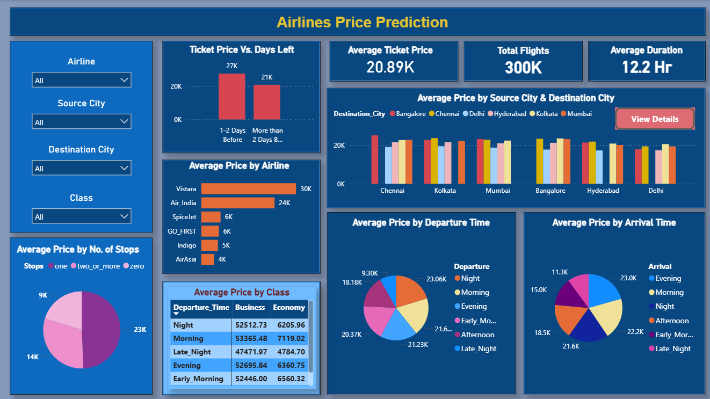
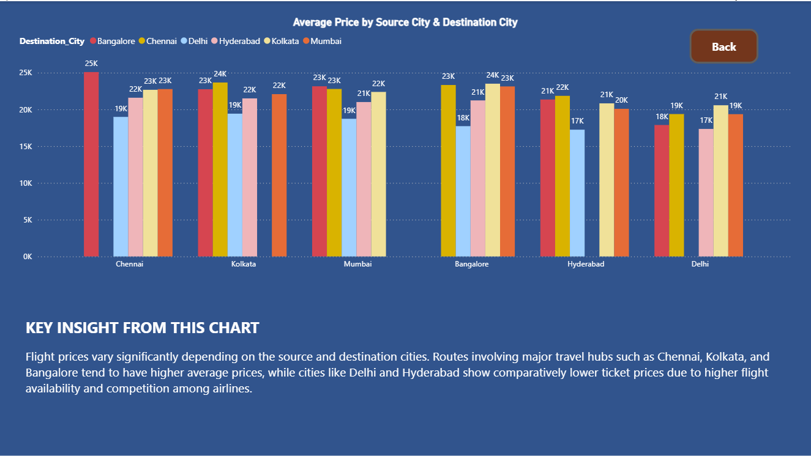

**Dashboard Overview**

1. Routes with higher average duration generally have higher average price, however a few routes show high price even when the duration is not that high, which indicates that route demand and airline competition also affecting pricing not only travel time.
2. Ticket prices vary significantly across different departure and arrival time combination. Evening and night arrival combinations show comparatively higher average prices. Early morning and late night combinations shows lower prices.
3. Tickets booked 1-2 days before departure have a higher average price than tickets booked earlier.
4. Vistara and Air India operate the highest number of flights compared to other airlines.
5. The average ticket price varies noticeably among different airlines. Vistara and Air India show higher average prices, while low cost carriers such AirAsia and Indigo show lower average prices.
6. Business Class prices are consistently much higher than Economy Class across all time periods. Within each class, prices vary slightly based on the time of the day(early morning, morning, evening,night etc.)

Conclusion:

Longer routes usually cost more, but pricing is also influenced by demand on specific routes. Flights prices are clearly influenced by the combination of departure and arrival time, reflecting time based demand patterns. Last minute booking are more expensive. Flights availability differs strongly across airlines. Different airlines follow different pricing strategies. Class of travel is also one of the strongest factor influencing ticket price.
The analysis shows that airline ticket prices are influenced by multiple factors including airline, booking time before departure, departure and arrival time, route and travel class. While longer routes generally have higher prices, demand patterns and airline strategies also pay a significant role. Business class and last minute bookings are consistently priced higher.

